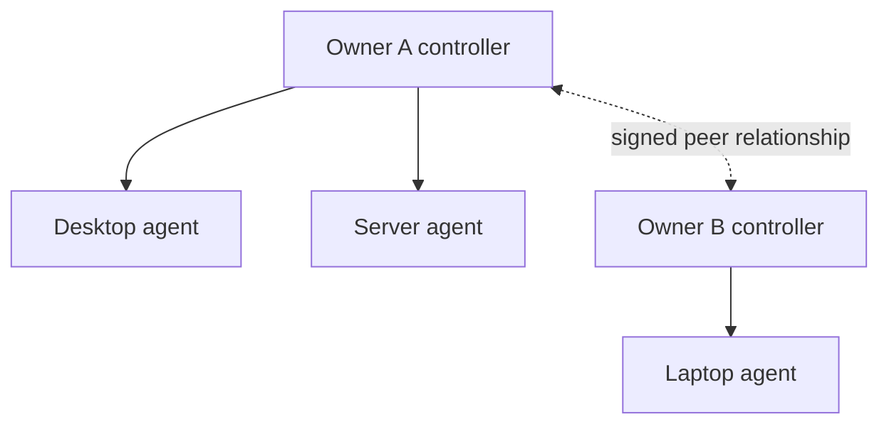

# MeshGrid

MeshGrid is a free, self-hosted platform for operating several computers as one pool. It borrows Kubernetes' desired-state scheduling model without requiring a vendor account or a globally privileged control plane.

Every installation is independently owned. Controllers can later establish signed peer relationships and share only the capacity their owners explicitly allow; local workloads, node metadata, credentials, and authority stay local by default.

## Current MVP

- Single static Go binary: controller, node agent, and CLI
- Linux, Windows, and macOS agents (Docker is the workload runtime)
- Declarative replicated container workloads
- Resource-aware placement for CPU, RAM, GPU count, and labels
- Heartbeats, failure detection, reconciliation, restarts, and deletion
- Persistent atomic JSON state with no external database
- Bearer-token authentication on all management and agent APIs
- Per-controller Ed25519 identity and peer registry foundation
- Federation is opt-in at both the workload and node level
- Dry-run agents for safe multi-node testing on one machine

The local scheduler and lifecycle are implemented. Cross-controller execution is intentionally marked as the next protocol milestone: the identity, peer, policy, and signed-envelope primitives are present, but this MVP will not pretend remote leases are complete until replay protection, revocation, and accounting are implemented.

## Build and test

```bash
make test
make vet
make build
```

## Five-minute local cluster

Terminal 1:

```bash
export MESHGRID_TOKEN='replace-with-a-long-random-secret'
./bin/meshgrid controller --listen :7443 --data ./data
```

Terminal 2 (safe simulation):

```bash
export MESHGRID_TOKEN='replace-with-a-long-random-secret'
./bin/meshgrid agent --controller http://127.0.0.1:7443 \
  --id workstation-1 --cpu 16000 --memory 32768 \
  --labels zone=home,gpu=nvidia --dry-run
```

Apply a workload:

```bash
./bin/meshgrid apply -f examples/hello.json
./bin/meshgrid get nodes
./bin/meshgrid get workloads
./bin/meshgrid get status
```

Remove it using the returned workload ID:

```bash
./bin/meshgrid delete w-123456789
```

Remove `--dry-run` to let the agent create Docker containers. The agent never mounts the Docker socket into a remotely supplied container, never enables privileged mode, and exposes no host network or host filesystem controls.

## Topology



There is no central MeshGrid service. DNS, TLS certificates, overlay networking, and storage remain operator choices. Tailscale, WireGuard, or a private LAN are sensible transports; do not expose the current HTTP endpoint directly to the public internet.

## Security model

- Generate a separate high-entropy cluster token per controller.
- Put the API behind TLS or a private encrypted overlay.
- A controller has authority only over agents enrolled with its token.
- Federation must require two-way peer approval; knowing a URL is insufficient.
- A node must set `--allow-federation`, and a workload must set `federated: true`, before remote placement can ever be considered.
- The agent accepts a deliberately narrow workload schema rather than arbitrary Docker flags.
- Secrets currently travel as workload environment values; production use needs encrypted secret envelopes before federation is enabled.

## Roadmap to production federation

1. Mutual peer approval with Ed25519 challenge/response and durable nonce replay protection.
2. Signed, expiring capacity advertisements containing coarse resource buckets rather than hardware inventories.
3. Signed remote lease requests, owner-defined quotas, image allowlists, and admission policy.
4. Lease renewal, cancellation, remote status receipts, and idempotent reconciliation.
5. WireGuard-based service networking with controller-independent peer routing.
6. Content-addressed encrypted volumes and explicit replication policies.
7. OIDC for humans, short-lived agent certificates, audit log chaining, and key rotation.
8. Raft only inside an owner's optional controller group—never as a mandatory global consensus layer.

## API

| Method | Path | Purpose |
|---|---|---|
| `GET` | `/healthz` | Unauthenticated liveness and peer ID |
| `POST` | `/v1/heartbeat` | Agent registration, status, desired assignments |
| `POST` | `/v1/workloads` | Create a declarative workload |
| `GET` | `/v1/workloads` | List workloads |
| `DELETE` | `/v1/workloads/{id}` | Delete workload and stop its containers |
| `GET` | `/v1/nodes` | List nodes |
| `GET` | `/v1/status` | Full local desired/observed state |
| `GET` | `/v1/identity` | Controller peer ID and public key |
| `POST` | `/v1/peers` | Add an approved peer record |

## License

Apache-2.0. See `LICENSE`.
